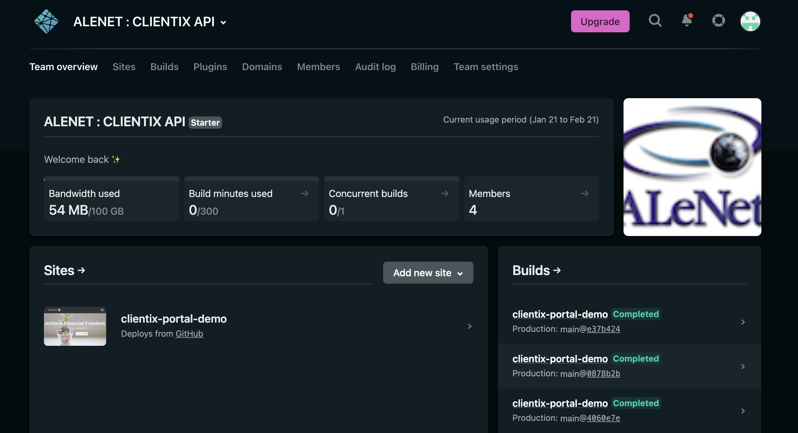

# Clientix Demo Banking Progressive Web App #

## Purpose: 
To demonstrate the functionality of the [Clientix](http://www.alenet.com/index.php/en/our-products/clientix-crm) API.

### Project URL: [Demo Portal](https://clientix-portal-demo.netlify.app/)

## Author:
Sebastian Ignacio Alegrett Morreo and the Clientix API Developer Team.

## Functionality:
The functionality will be based on the Clientix © CRM [AleNet, Inc](http://www.alenet.com/index.php/en/):
  * Log In : Two Factored Authentication (Single-factored at the moment).
  * Sign Up: Two Step Sign Up (Ice-box)
  * Account Security Features
  * Account Customer Service Features 
  * Account Trusts
  * Multiple Language Usage
  * Account Transactions
  * Account Information
  * File Upload and Download.

## Project Inner Workings:
  * *App.js* : Base Routing and Top Level of the application. 
  * *Index.js* : DOM Rendering and initial state configuration.
  * *Components* : Custom UI/UX Component Library used throught the pages of the app:
    - *Navbar.js*: Custom NavBar
    - *Button.js*: Custom Button
    - *Cards.js*: Custom Card component used in the *HeroSection* of the application.
    - *Cards2.js*: Probably a modularity fail, however this serves the purpose of having a differently customzied set of Cards for the Main Menu after Login.
    - *Dropdown.js*: Custom Dropdown used for language selection.
    - *DropdownElement.js*: Custom Dropdown element used throught the main information pages of the application (i.e., *MyAccounts*).
    - *DropdownTable.js*: Different from *Dropdown.js*, it is also used in the main information pages throughout the app.
    - *ErrorPage.js*: Custom Component used to display certain errors, many different pages have specific error messages to be carried throughout.
    - *Footer.js*: Custom footer used in the main landing page.
    - *FormSuccess.js*: Currently only used as a placeholder for sign-up success. *NOTE THAT NO SIGN UP FUNCTIONALITY IS YET IMPLEMENTED FULL WITH BACKEND*.
    - *FullPageLoader.js*: Custom Loader used when Logging in to the application.
    - *HeroSection.js*: Main Landing page component above the *Cards*.
    - *Login.js*: The main Login Component can be found here, ALl inputs and handling is done in this component.
    - *LoginForm.js*: Logic for the *Login* component submission handling is here, the `onSubmit` functionality is all done in this page.
    - *Popup.js*: Custom Overlayed popup used in the *ServiceRequest* page to denote a successful submission.
    - *SideMenu.js*: Main menu component used to navigate the application once logged in.
    - *SignUp.js*: PRELIMINARY functionality in place for Sign up logic, this is not yet connected to Clientix Backend.
    - *SignUpForm.js*: Same Idea as the *LoginForm*, this Sign up component would handle all `onSubmit` logic for the Sign up process.
    - *Table.js*: A custom Table component, currently not being used but nice to have.
    - *TextArea.js*: A Custom TextArea in place for the Service Requests since it must handle submission separately.
    - *STYLES*: All Styling can be found in a subdirectory `/styles` inside the `components` directory.
  

  * *Functions*: Contains hooks and classes being used throughout the application, but extrapolated for modularity.
    - **ClientixAPI.js**: All logic related to the clientix API fetch calls being made. `GETS & POSTS` are all being handled in this file. For more information visit our API Documentation Page. (Ice-box: No URL at the moment).
    - *DataProcessingUtil.js*: A Class file that is used to handle all data that is retrieved from the Clientix Backend. Several functions in here are built exclusively to handle the data and beautify it before display.
    - *useForm.js*: A Hook being used in the login functionality of the application.
    - *useFullPageLoader.js*: A Hook being used to call the Loader after the user Logs into the application.
    - *validateInfoLogin.js*: A validation function being used to validate the fields on the Login.
    - *validateInfoSignUp.js*: A validation function being used to validate the fields on the SignUp.

  * *Pages* : All Specific Routed Components in the application are in this folder.
    - *Account.js*: The main Menu Once a user Logs in.
    - *Home.js*: Main Lading Page of the application, first page that pops up when you enter the URL.
    - *Login.js*: The Login Page.
    - *LoginError.js*: The Login Page's custom Login Error Page, will pop up if the authentication fails, Routes user back to `/Login`.
    - *MyAccounts.js*: Displays the users account data.
    - *MyAccountsError.js*: The MyAccounts Page's custom  Error Page, will pop up if the information retrieval fails, Routes user back to `/Account`.
    - *MyTransactions.js*: Displays the users Transaction data.
    - *MyTransactionsError.js*: The MyTransactions Page's custom  Error Page, will pop up if the information retrieval fails, Routes user back to `/Account`.
    - *MyTrusts.js*: Displays the users Trust data.
    - *MyTrustsError.js*: The MyTrusts Page's custom  Error Page, will pop up if the information retrieval fails, Routes user back to `/Account`.
    - *Products.js*: Used as a decorative Page for the main landing of the website.
    - *ServiceRequests.js*: A page where a user will be able to submit a Service Request to their account. They can specify the problems they're having and upload files describing their issue.
    - *Services.js*: Used as a decorative Page for the main landing of the website.
    - *Signup.js*: The Signup Page.
    - *STYLES*: All Styling can be found in a subdirectory `/styles` inside the `pages` directory.

# Getting Started:

1. Clone this git repo to a local directory of your choice:

`git clone https://github.com/ALeNet-Inc/demo-portal`

## If you have node installed:

2. Run the command: `npm ci` at the `demo-portal` directory.
  - This should install all project dependencies in a node_modules directory.
  - If there is a problem, try `npm install` and restart the process.
  - If the problem persists, try `npm prune`.
  - Lastly, if all else fails, reclone the repository to an empty directory and install node once again.

3. Run the command `npm start`
  - This command will open a localhost:300 browser window for you and run the project locally for development.
4. Enjoy Developing!

## If you don't have node installed:

2. Install node:
  - https://nodejs.org/en/download/
  - Pick your environment of choice (MacOS, Windows, Linux)
  - run the command `node -v` in your terminal/commandline to verify that node is installed.

3. See steps above.

# Dependencies:

    "@popperjs/core": "^2.9.2",
    "@testing-library/jest-dom": "^5.13.0",
    "@testing-library/react": "^11.2.7",
    "@testing-library/user-event": "^12.8.3",
    "axios": "^0.21.3",
    "bootstrap": "^4.6.0",
    "flag-icon-css": "^3.5.0",
    "i18next": "^20.3.2",
    "i18next-browser-languagedetector": "^6.1.2",
    "i18next-http-backend": "^1.2.6",
    "jQuery": "^1.7.4",
    "jquery": "^3.6.0",
    "js-cookie": "^2.2.1",
    "react": "^17.0.2",
    "react-bootstrap": "^1.6.1",
    "react-dom": "^17.0.2",
    "react-dropdown": "^1.9.2",
    "react-i18next": "^11.11.0",
    "react-icons": "^4.2.0",
    "react-router-dom": "^5.2.0",
    "react-scripts": "4.0.3",
    "react-table": "^7.7.0",
    "react-transition-group": "^4.4.2",
    "semantic-ui-react": "^2.0.3",
    "web-vitals": "^1.1.2"

  - Make sure after you perform the steps above that all of these dependencies are in your `package.json` file.
  - If one or more is missing run the command: `npm i dependency` and replace 'dependency' with the one that is missing from your file without the @.

  # Deployment with Netlify

  * This app is currently being deployed using [Netlify](https://www.netlify.com/)
  * To log into the netlify deployment center, use the credential:
    - Username: sebasalegrett12@gmail.com
    - Password: Alegrett1212.
  * In there you should see a dashbord with the currently deployed websites:
  
  * Click on `clientix-portal-demo`
  * There you should see a dashbord Like this:
  
  * There you can manage all your deployment builds,
  * Check on the status of the application,
  * Change your URL,
  * and many more options...
  * For more information visit: [Docs](https://docs.netlify.com/?_ga=2.176073314.1308383335.1645099037-1716576547.1645099037)

  # Download the app as PWA:

  ## From The Browser:

  1. Go to your Browser of choice. Preferably, Google Chrome and type:
    - https://clientix-portal-demo.netlify.app/

  2. You should see the landing page for the portal:
    

  3. In the top right corner, inside the URL box, you should see a download button. Click on it.
  
    - Yours might look slightly different since I already have the app downloaded.

  ## From Your Mobile Device:

  1. Go to your Browser of choice. Preferably, Google Chrome and type:
    - https://clientix-portal-demo.netlify.app/
  2. On the options for your browser, as if you were to share the page, click on the one that says save to homescreen.

  # Log in to the portal:

  * The team has set up a demo user to showcase the functionality of the portal.

  * Click on the login button at the top right of the page.
     - if you are on mobile, Open the hamburger menu and click login
  * Once you are there type the username and password:
    - Username: mbelfort
    - password: welcome

  * The loading page will pop up and you should be in the portal in no time!

# Conclusion

If you have any other questions on the application, reach out to the clientix team and ask!

ENJOY THE APP!

